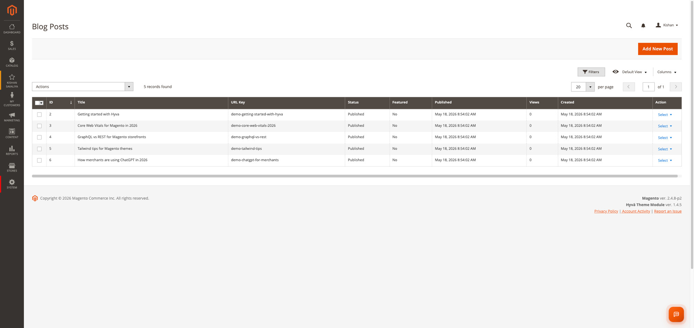
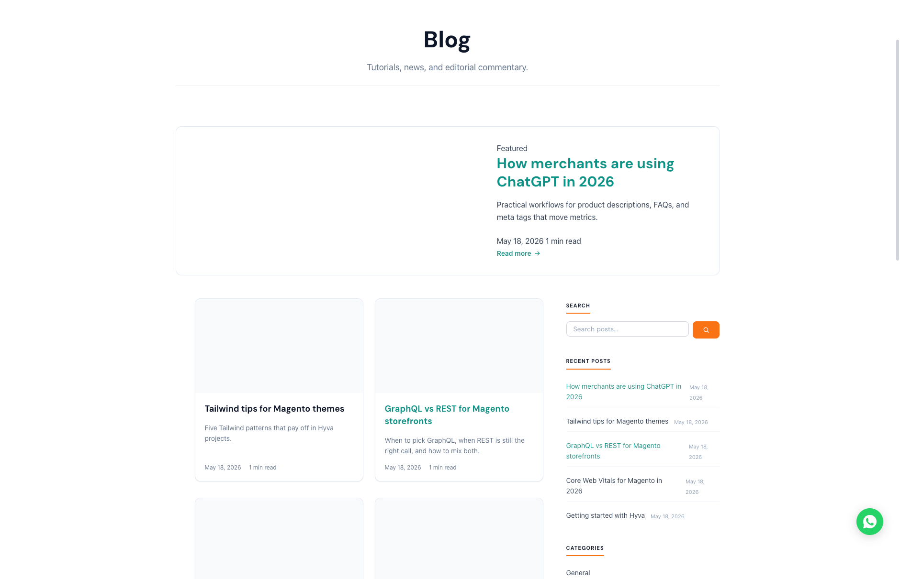
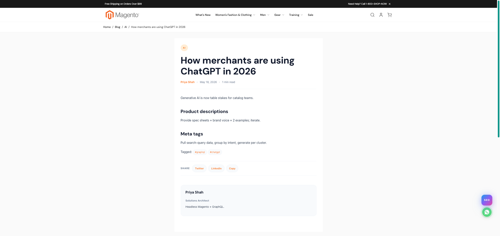

# Magento 2 Blog

Panth Blog (`Panth_Blog`) adds a blog to a Magento 2 store: posts, hierarchical categories, tags, authors and moderated comments, managed from the Magento admin and served under a configurable URL prefix (default `/blog`). It outputs JSON-LD structured data, RSS 2.0 and Atom 1.0 feeds, a Markdown version of each post, and queues post URLs for IndexNow. It is intended for merchants who publish articles, guides or news on their store, and for developers who need the content over REST or GraphQL.

The storefront uses one set of `.phtml` templates styled by a plain CSS file (`view/frontend/web/css/blog.css`). The templates contain no Alpine.js, jQuery or RequireJS code, so the same output is used on Hyva and Luma themes.

Product page: [kishansavaliya.com/magento-2-blog.html](https://kishansavaliya.com/magento-2-blog.html)

## Features

- **Posts** with title, URL key, short description, WYSIWYG content, featured image and alt text, status (`draft`, `scheduled`, `published`, `archived`), publish date, featured flag, per-post comment and table-of-contents toggles, layout template, sort order, author, and SEO fields (meta title, meta description, meta keywords, meta robots, canonical URL, OG image), plus a TL;DR summary and a citation list (JSON).
- **Categories** with parent category, description, image, active flag, sort order, per-category listing template (Grid, List or Magazine) and posts per page, and meta title, description and robots.
- **Tags** with name, URL key, description and meta robots.
- **Authors** with display name, URL key, role, email, avatar, short and long bio, links, and the schema fields `knows_about`, `alumni_of` and `same_as`.
- **Comments** (disabled by default) with statuses pending, approved, spam and trash, optional threaded replies, `rel="nofollow"` on external links, auto-approval for logged-in customers, and an optional admin email for each new comment.
- **Related posts**: manually linked posts first, then filled from other published posts in the post's primary category, newest first, up to the configured count.
- **URL history**: when the URL key of a post or category changes, the old key is recorded and requests for it are answered with a 301 redirect to the new URL. Deleting a post removes its history rows, so its old URLs return 404.
- **Scheduled publishing**: a cron job publishes `scheduled` posts once their publish date has passed.
- **JSON-LD**: `BlogPosting`, `Person` and `BreadcrumbList` on post pages (plus `HowTo` when detected), `Blog` or `CollectionPage` on the index, category and tag pages, and `ProfilePage` with `Person` on author pages.
- **HowTo detection**: when enabled, a post with two or more H2 headings of the form "1. Step name" or "Step 1 Step name" gets `HowTo` schema.
- **TL;DR**: when enabled and the TL;DR field is empty, a summary is taken from the start of the post content on save.
- **Table of contents** built from H2 and H3 headings, shown when the post has at least three H2 headings.
- **Reading time** calculated from word count and the configured reading speed.
- **Share links** for Twitter and LinkedIn, plus a link to the post's canonical URL.
- **Feeds**: site-wide RSS 2.0 and Atom 1.0, and RSS per category, tag and author, cached in their own cache type.
- **Markdown export** of each published post at `/<route>/<url-key>.md`.
- **Tag thin-content rule**: a nightly job sets tags with fewer published posts than the threshold to `noindex,follow` and the rest to `index,follow`.
- **Post-card badges**: primary category, first tag, and optional Featured and New badges.
- **Optional integrations** that only run when the other Panth module is installed: a blog section in `llms.txt`, `llms-full.txt` and `llms.json` (Panth_LlmsTxt), and the post's own OG image on post pages (Panth_SocialMeta).
- **REST API** and read-only **GraphQL** queries for posts, categories, tags and authors.
- **Console commands** for URL rewrites, counts, import and export, IndexNow and demo data.







## Compatibility

| Item | Supported |
|---|---|
| Magento Open Source | 2.4.4 to 2.4.8 |
| Adobe Commerce | 2.4.4 to 2.4.8 |
| PHP | 8.1, 8.2, 8.3, 8.4 (`~8.1.0\|\|~8.2.0\|\|~8.3.0\|\|~8.4.0`) |
| Themes | Hyva and Luma (shared templates and CSS, no theme-specific JavaScript) |

Magento Composer constraints: `magento/framework ^103.0`, `magento/module-backend ^102.0`, `magento/module-catalog ^104.0` (image uploader), `magento/module-cms ^104.0`, `magento/module-store ^101.0`, `magento/module-ui ^101.0`, `magento/module-url-rewrite ^102.0`.

## Requirements

- `mage2kishan/module-core` `^1.0` (module `Panth_Core`), installed automatically by Composer.
- Magento cron must be running for scheduled publishing, count refresh, feed cache warming and IndexNow delivery.
- Optional, suggested in `composer.json`: `mage2kishan/module-social-meta` for per-post Open Graph and Twitter card images.

## Installation

```bash
composer require mage2kishan/module-blog
bin/magento module:enable Panth_Core Panth_Blog
bin/magento setup:upgrade
bin/magento setup:di:compile
bin/magento cache:flush
bin/magento setup:static-content:deploy -f
```

`setup:di:compile` is only needed in production mode. `setup:static-content:deploy -f` is needed because the module ships `view/frontend/web/css/blog.css`.

Check that the module is enabled:

```bash
bin/magento module:status Panth_Blog
```

On install the module creates one author (`Admin`, URL key `admin`) and three categories: General, Tutorials and News.

## Configuration

Admin path: **Stores > Configuration > Panth > Blog**. The section is also linked from the admin menu at **Panth Infotech > Blog > Configuration**. All paths below start with `panth_blog/`.

### General (`panth_blog/general/...`)

| Setting | Default | What it does |
|---|---|---|
| Enabled | Yes | Turns the blog router, pages, feeds and Markdown export on or off. (`enabled`) |
| Route Front Name | `blog` | URL prefix for all blog pages. Website scope. Comment: "Changing this requires URL rewrite rebuild." (`route_frontname`) |
| Blog Index Title | `Blog` | Title of the blog index page. (`index_title`) |
| Blog Index Meta Description | `Latest articles and tutorials.` | Meta description of the index page. (`index_description`) |
| Blog Hero Text | `Tutorials, news, and editorial commentary.` | Text shown in the index page header. (`index_hero_text`) |
| Posts Per Page | 10 | Posts per listing page. (`posts_per_page`) |
| Reading Speed (words/min) | 220 | Used to calculate reading time. Website scope. (`reading_speed_wpm`) |
| Show Reading Time | Yes | Shows reading time on posts. (`show_reading_time`) |
| Show Author Bio at Post Foot | Yes | Shows the author card below the post. (`show_author_bio`) |
| Show Share Buttons | Yes | Shows the share links on posts. (`show_share_buttons`) |

### Display (`panth_blog/display/...`)

| Setting | Default | What it does |
|---|---|---|
| Show Table of Contents | Yes | Shows the table of contents on posts that have it enabled and at least three H2 headings. (`show_toc`) |
| Related Posts Count | 3 | Number of related posts under a post. (`related_posts_count`) |
| Default Category Template | Grid | Listing layout for categories: Grid, List or Magazine. (`category_template`) |
| Sidebar: Categories | Yes | Shows the categories block in the sidebar. (`sidebar_show_categories`) |
| Sidebar: Tag Cloud | Yes | Shows the tag cloud in the sidebar. (`sidebar_show_tag_cloud`) |
| Sidebar: Search | Yes | Shows the search box in the sidebar. (`sidebar_show_search`) |
| Show Post-card Badges | Yes | Shows category and tag badges on post cards. (`show_badges`) |
| Show "Featured" Badge | Yes | Shows a Featured badge on featured posts. Visible when Show Post-card Badges is Yes. (`show_featured_badge`) |
| "New" Badge Window (days) | 0 | Posts published within this many days show a New badge; 0 disables it. Visible when Show Post-card Badges is Yes. (`new_badge_days`) |

### RSS / Atom Feeds (`panth_blog/feeds/...`)

| Setting | Default | What it does |
|---|---|---|
| Enable Feeds | Yes | Turns all feed endpoints on or off. (`enabled`) |
| Posts Per Feed | 25 | Maximum items per feed. (`posts_per_feed`) |
| Include Full Content | No | Adds the full post content to feed items. (`include_full_content`) |
| Per-Category Feeds | Yes | Enables per-category RSS feeds. (`per_category_feeds`) |
| Per-Tag Feeds | No | Enables per-tag RSS feeds. (`per_tag_feeds`) |
| Per-Author Feeds | Yes | Enables per-author RSS feeds. (`per_author_feeds`) |
| Cache TTL (seconds) | 3600 | Lifetime of cached feed output. (`cache_ttl_seconds`) |

### SEO (`panth_blog/seo/...`)

| Setting | Default | What it does |
|---|---|---|
| Title Template | `{{post.title}}` | Page title template for posts. Tokens: `{{post.title}}`, `{{post.meta_title}}`, `{{post.category}}`, `{{post.author}}`. (`title_template`) |
| Fallback Meta Description | `Latest articles and tutorials.` | Meta description used when a post has none. (`default_meta_description`) |
| Tag Thin-Content Threshold | 3 | Tags with fewer published posts are set to `noindex,follow` by the nightly job. (`tag_thin_content_threshold`) |
| Use Post Featured Image as OG/Twitter Image | Yes | With Panth_SocialMeta installed, sets `og:image` on post pages to the post's OG image, or its featured image. (`og_use_featured_image`) |

### AEO (Answer Engine Optimisation) (`panth_blog/aeo/...`)

| Setting | Default | What it does |
|---|---|---|
| Auto-extract TL;DR | Yes | Fills an empty TL;DR from the start of the content on save. (`auto_extract_tldr`) |
| HowTo Auto-detect | Yes | Adds `HowTo` JSON-LD when numbered H2 steps are found. (`howto_auto_detect`) |

### AIO (AI Indexing) (`panth_blog/aio/...`)

| Setting | Default | What it does |
|---|---|---|
| Include in llms.txt | Yes | Adds a blog section to `/llms.txt` and `/llms.json` when Panth_LlmsTxt is installed. (`llms_txt_include`) |
| Max Posts in llms.txt Blog Section | 50 | Maximum posts listed in `/llms.txt` and `/llms.json`; 0 falls back to 50. (`llms_txt_max_posts`) |
| Include in llms-full.txt | Yes | Adds the blog section to `/llms-full.txt` when Panth_LlmsTxt is installed. (`llms_full_txt_include`) |
| Enable Markdown Export Endpoint | Yes | Enables `/<route>/<url-key>.md`. (`markdown_export_enabled`) |

### IndexNow (`panth_blog/indexnow/...`)

| Setting | Default | What it does |
|---|---|---|
| Enable IndexNow Notifications | Yes | Master switch for queueing and sending. (`enabled`) |
| Notify on Publish | Yes | Queues the post URL when a post is saved with status published. (`notify_on_publish`) |
| Notify on Update | Yes | Also queues already-published posts on every save. Only takes effect when Notify on Publish is Yes. (`notify_on_update`) |
| Notify on Delete | No | Queues the post URL when a post is deleted. (`notify_on_delete`) |
| Batch Size | 100 | Maximum URLs sent per cron run. Default scope only. (`batch_size`) |
| API Key | (empty) | IndexNow key, 8 to 128 letters, digits or dashes. Default scope only. Nothing is sent while it is empty or invalid. (`api_key`) |

### Comments (`panth_blog/comments/...`)

All fields except Enable Comments are visible only when Enable Comments is Yes.

| Setting | Default | What it does |
|---|---|---|
| Enable Comments | No | Shows the comment section and accepts submissions. (`enabled`) |
| Who Can Comment | Everyone | Everyone, Registered Customers Only, or Nobody (Read-only). (`allow_for`) |
| Auto-approve Registered Customers | Yes | Comments from logged-in customers are saved as approved; all others as pending. (`auto_approve_registered`) |
| Max Submissions per Hour per IP | 3 | Rejects a submission when this many comments from the same IP address were saved in the last hour. 0 disables the limit. (`max_per_hour_per_ip`) |
| Allow Threaded Replies | Yes | Shows a Reply button on each comment and nests replies under their parent; the parent must belong to the same post. (`enable_threading`) |
| Require CAPTCHA | No | When Yes, a submission must pass the selected CAPTCHA before it is saved. No keeps the comment form without a CAPTCHA, as in earlier versions. (`captcha_enabled`) |
| CAPTCHA Provider | Math Question | Math Question, Cloudflare Turnstile, hCaptcha, reCAPTCHA v3 or None. Math Question needs no keys. The other three need a site key and secret key; while either is empty the Math Question is used. Visible when Require CAPTCHA is Yes. (`captcha_provider`) |
| CAPTCHA Site Key | (empty) | Public key of the Turnstile, hCaptcha or reCAPTCHA v3 site. (`captcha_site_key`) |
| CAPTCHA Secret Key | (empty) | Secret key used for server-side verification, stored encrypted. (`captcha_secret_key`) |
| Add rel="nofollow" to External Links | Yes | Adds `rel="nofollow"` to external links in submitted comments. (`nofollow_external_links`) |
| Email Admin on New Comment | No | Sends the `Panth Blog: New Comment Notification` email on the first save of a comment. (`notify_admin_enabled`) |
| Notification Recipient Email | (empty) | Recipient; blank uses the store General Contact email. Visible when Email Admin on New Comment is Yes. (`notify_recipient_email`) |
| Notification Sender (Email Identity) | General Contact | From identity for the email. Visible when Email Admin on New Comment is Yes. (`notify_sender_identity`) |

### Admin menu

Under **Panth Infotech > Blog**: Manage Posts, Manage Categories, Manage Tags, Manage Authors, Manage Comments, Configuration.

## Usage

### Managing content

- **Posts**: grid with keyword search (title, URL key, meta title, short description), mass delete and mass status (Draft, Published, Archived), and a Duplicate action. The edit form has the tabs Content, Publishing, Categorisation (author, store views, categories, primary category, tags, related posts), SEO and AEO / AIO. The URL key is converted to a valid slug and must be unique; the canonical URL must be an http(s) URL or a path starting with "/"; publishing without a date sets it to the current time.
- **Categories**, **Tags**, **Authors**: grids with mass delete and mass status, and edit forms with the fields listed under Features.
- **Comments**: grid with keyword search (author name, author email, content), mass delete and mass Approve, Pending, Spam and Trash. The edit form shows post, author details, content, status and user agent.

Every edit form has the buttons Back, Delete, Reset, Save and Continue Edit and Save. Reset restores the values the form was opened with, without reloading the page; Save and Continue Edit saves and reopens the record.

Categories, tags, store views and related posts are set in the Categorisation section of the post form (also through `panth:blog:post:import` front matter). The category form has a Store View field. All Store Views shows the record in every store view.

The featured image and OG image of a post, the category image and the author avatar are uploaded from the edit forms (JPG, PNG, GIF or WebP, up to 4 MB). Files are stored under `pub/media/blog` and the field keeps the path relative to that folder. Single delete and duplicate actions are sent as POST requests.

### Store views and caching

A post or category with no rows in `panth_blog_post_store` / `panth_blog_category_store`, or with store `0`, is shown in every store view. A post or category linked to specific store views is only shown there: post and category pages, the index, category, tag, author and search listings, the sidebar, related posts, feeds, Markdown export, comment submission, `llms.txt`, REST and GraphQL. Per-store text overrides (`panth_blog_post_value`) are not used.

Blog pages carry the `panth_blog_post`, `panth_blog_category`, `panth_blog_tag`, `panth_blog_author` and `panth_blog_comment` cache tags, so saving, deleting or approving content (including the scheduled-publish and count-refresh cron jobs) refreshes the cached blog pages without a full cache flush.

### Storefront URLs

`<route>` is the Route Front Name (default `blog`).

| Path | Page |
|---|---|
| `/<route>` | Blog index |
| `/<route>/page/N` | Index, page N |
| `/<route>/<url-key>` | Post (published posts only) |
| `/<route>/<url-key>.md` | Markdown export of a post |
| `/<route>/category/<url-key>` and `/page/N` | Category listing |
| `/<route>/tag/<url-key>` and `/page/N` | Tag listing |
| `/<route>/author/<url-key>` and `/page/N` | Author page |
| `/<route>/search?q=<term>` | Search results |

A bare `/<route>/<url-key>` that is not a post also resolves to a category, tag or author with that URL key. Unknown slugs return 404.

### Feeds

| Path | Format | Controlled by |
|---|---|---|
| `/<route>/feed.xml` | RSS 2.0 | Enable Feeds |
| `/<route>/feed/atom.xml` | Atom 1.0 | Enable Feeds |
| `/<route>/feed/category/<url-key>.xml` | RSS 2.0 | Per-Category Feeds |
| `/<route>/feed/tag/<url-key>.xml` | RSS 2.0 | Per-Tag Feeds |
| `/<route>/feed/author/<url-key>.xml` | RSS 2.0 | Per-Author Feeds |

Every storefront page gets `<link rel="alternate" type="application/rss+xml">` pointing to `/<route>/feed.xml`.

### Comments

When comments are enabled, the post page lists approved comments and shows a form (name, email, website, comment). Submissions post to `blog/comment/submit`, are checked against the form key, the CAPTCHA (when Require CAPTCHA is Yes), Who Can Comment and the post's own comment flag, and are saved as pending or approved.

The Math Question is a signed sum of two numbers rendered into the form, so it works on full-page-cached post pages. Turnstile and hCaptcha render their widget; reCAPTCHA v3 requests a token when the form is submitted and accepts scores of 0.5 or higher. Their scripts are loaded only when that provider is active, and their hosts are listed in `etc/csp_whitelist.xml`. The commenter IP address is stored as text in `panth_blog_comment.ip` (up to 45 characters, so IPv6 addresses fit).

### Scheduled publishing

Set a post's status to `scheduled` and its Published At date. The `panth_blog_publish_scheduled` job changes the status to `published` once that date has passed.

### IndexNow

Saving or deleting a post (per the IndexNow settings) inserts one row per store view the post is assigned to into `panth_blog_indexnow_queue` (All Store Views means every active store view), with that store's base URL, blog route and `store_id`. Store views removed from a published post, unpublished posts and deleted posts queue their old URLs only when Notify on Delete is Yes. The `panth_blog_notify_indexnow` job reads up to Batch Size pending rows and sends them in one JSON POST to the IndexNow endpoint on `api.indexnow.org` with the host, key, key location (the key file `<key>.txt` at the root of the host, over HTTPS) and URL list. The key is set in the API Key field (`panth_blog/indexnow/api_key`); while it is empty or invalid nothing is sent and rows stay pending. Only rows whose host matches the first pending row are sent in one request; the others stay pending for a later run. Rows are marked `sent` only after a 2xx response and `failed` otherwise. See the [IndexNow documentation](https://www.indexnow.org/documentation) for the key file.

### Cron jobs

| Job | Schedule | What it does |
|---|---|---|
| `panth_blog_publish_scheduled` | `*/5 * * * *` | Publishes scheduled posts whose publish date has passed, through the post repository (save events, IndexNow queue, page cache refresh). |
| `panth_blog_notify_indexnow` | `*/5 * * * *` | Sends queued URLs to IndexNow. |
| `panth_blog_warm_feed_cache` | `15 * * * *` | Clears the `panth_blog_feed` cache and rebuilds the site-wide RSS and Atom feeds for each store where the blog and feeds are enabled. |
| `panth_blog_refresh_post_counts` | `30 3 * * *` | Recounts published posts per category and tag, then applies the tag thin-content rule. |
| `panth_blog_archive_stale_drafts` | `0 5 * * 0` | Sets drafts not updated for 180 days to `archived`. |

### Console commands

| Command | What it does |
|---|---|
| `bin/magento panth:blog:url-rewrite:rebuild` | Deletes and recreates `url_rewrite` rows for posts, categories, tags and authors in every store. |
| `bin/magento panth:blog:counts:refresh` | Runs the post count refresh (same as the nightly job). |
| `bin/magento panth:blog:post:export --post-id=<id> [--format=markdown]` | Writes a post as Markdown to stdout. |
| `bin/magento panth:blog:post:import <file>` | Imports a Markdown file with YAML front matter (`title` required; `url_key`, `status`, `short_description`, `published_at`, `author`, `tags`, `categories` optional) as a new post. Status defaults to `draft`. |
| `bin/magento panth:blog:indexnow:ping --post-id=<id>` | Adds the post URL of each assigned store view to the IndexNow queue. |
| `bin/magento panth:blog:tags:auto-robots` | Applies the tag thin-content rule. |
| `bin/magento panth:blog:og-images:generate [--post-id=<id>]` | Placeholder; prints that OG image generation is not implemented. |
| `bin/magento panth:blog:seed:demo` | Creates demo authors, categories, tags and posts for testing. |

### XML sitemap

This module does not register itself with any sitemap. `mage2kishan/module-xml-sitemap` lists `mage2kishan/module-blog` under `suggest` in its `composer.json`, and its own `Panth\XmlSitemap\Model\Sitemap\Contributor\BlogContributor` reads the `panth_blog_post`, `panth_blog_category`, `panth_blog_tag` and `panth_blog_author` tables and the `panth_blog/general/route_frontname` setting to add published posts, active categories, tags, active authors and the blog index to the XML sitemap.

## Developer Notes

- Module: `Panth_Blog`. Package: `mage2kishan/module-blog`. Namespace: `Panth\Blog\`.
- Service contracts: `Panth\Blog\Api\PostRepositoryInterface`, `CategoryRepositoryInterface`, `TagRepositoryInterface`, `AuthorRepositoryInterface`, `CommentRepositoryInterface`, with data interfaces under `Api\Data`.
- Router: `Panth\Blog\Controller\Router\BlogRouter` (frontend router list, sort order 25). The standard frontend route `blog` is also declared; the admin route is `panth_blog`.
- Events dispatched and observed by the module: `panth_blog_post_save_before` (URL key, word count, reading time, TL;DR), `panth_blog_post_save_after` (IndexNow queue, URL history, JSON-LD cache invalidation), `panth_blog_post_delete_before` (store views for the queue), `panth_blog_post_delete_after` (IndexNow queue, URL history cleanup), `panth_blog_category_save_after`, `panth_blog_comment_save_commit_after` (admin email).
- Plugins on optional classes: `Panth\LlmsTxt\Model\LlmsTxt\Builder`, `FullBuilder` and `JsonBuilder`; `Panth\SocialMeta\Model\Social\OpenGraphResolver` (frontend).
- Cache types: `panth_blog_feed`, `panth_blog_jsonld`, `panth_blog_llmstxt`.
- Email template: `panth_blog_comment_notification`.
- REST (`/V1/panth-blog/...`): `posts`, `categories`, `tags`, `authors`, each with `GET` (list, `searchCriteria` query), `GET /:id`, `POST`, `PUT /:id` and `DELETE /:id`. The request body wraps the record in `post`, `category`, `tag` or `author`; on PUT the id in the URL is written into the record. POST, PUT and DELETE require the matching ACL resource (`Panth_Blog::post`, `::category`, `::tag`, `::author`).
- REST reads: a caller with the matching ACL resource (admin or integration token) sees every record. Anonymous and customer callers only see published posts, active categories and active authors that are visible in the current store view (no store rows, store 0 or the current store in `panth_blog_post_store` / `panth_blog_category_store`); other ids return 404. Author `email` and `user_id` are removed from anonymous responses, and filtering or sorting authors by those fields returns 400. Tags have no status and are always readable.
- `store_id` is available as a search criteria filter on posts and categories (for example `searchCriteria[filterGroups][0][filters][0][field]=store_id` with value `2`) and matches records visible in that store view.
- GraphQL queries (`etc/schema.graphqls`): `panthBlogPosts(filter, pageSize, currentPage)`, `panthBlogPost(id, urlKey)`, `panthBlogCategories`, `panthBlogTags`, `panthBlogAuthors`. The post queries return published posts visible in the current store view; `filter` accepts `category_url_key`, `tag_url_key` and `author_url_key`, the `status` filter is ignored, and `pageSize` is capped at 100. Categories and authors return active records only (categories also by store view).
- ACL: `Panth_Blog::all` with `Panth_Blog::post` (`post_save`, `post_delete`), `Panth_Blog::category` (`category_save`, `category_delete`), `Panth_Blog::tag` (`tag_save`, `tag_delete`), `Panth_Blog::author` (`author_save`, `author_delete`), `Panth_Blog::comment`, `Panth_Blog::config`. Save, mass status and duplicate actions require the `*_save` resource; delete and mass delete require the `*_delete` resource. Save, mass status, mass delete, delete, duplicate and image upload accept POST only. Image upload (`panth_blog/image/upload`) requires one of the `post_save`, `category_save` or `author_save` resources.
- Tables: `panth_blog_post`, `panth_blog_post_value`, `panth_blog_category`, `panth_blog_tag`, `panth_blog_author`, `panth_blog_post_category`, `panth_blog_post_tag`, `panth_blog_post_store`, `panth_blog_category_store`, `panth_blog_post_related`, `panth_blog_comment`, `panth_blog_url_history`, `panth_blog_indexnow_queue`.
- `etc/config.xml` also sets defaults for paths with no admin field, such as `display/toc_min_h2` (3), which sets the minimum H2 count for the table of contents.
- The Route Front Name is used for the RSS `<link>`, the sidebar RSS and search links, breadcrumbs, canonical URLs, JSON-LD breadcrumbs, feed channel links, the comment form action and the request paths written by `panth:blog:url-rewrite:rebuild` (per store).

## Uninstallation

```bash
bin/magento module:disable Panth_Blog
composer remove mage2kishan/module-blog
bin/magento setup:upgrade
bin/magento cache:flush
```

The module has no uninstall routine. The `panth_blog_*` tables listed above, the `panth_blog/*` rows in `core_config_data`, any `url_rewrite` rows created by `panth:blog:url-rewrite:rebuild`, and uploaded images under `pub/media` remain until removed manually.

## Support

- Product page: [kishansavaliya.com/magento-2-blog.html](https://kishansavaliya.com/magento-2-blog.html)
- Contact: [kishansavaliya.com/contact](https://kishansavaliya.com/contact)
- Email: kishansavaliyakb@gmail.com
- Issues: [github.com/mage2sk/module-blog/issues](https://github.com/mage2sk/module-blog/issues)

## Documentation

See [USER_GUIDE.md](USER_GUIDE.md).

## License

Proprietary, as declared in `composer.json`. The package is published on Packagist and can be installed with Composer; see the product page for the terms of use.

## Changelog

See [CHANGELOG.md](CHANGELOG.md).

## Links

- Website: [kishansavaliya.com](https://kishansavaliya.com)
- All extensions catalogue: [kishansavaliya.com/magento-extensions.html](https://kishansavaliya.com/magento-extensions.html)
- GitHub: [github.com/mage2sk/module-blog](https://github.com/mage2sk/module-blog)
- Packagist: [packagist.org/packages/mage2kishan/module-blog](https://packagist.org/packages/mage2kishan/module-blog)
